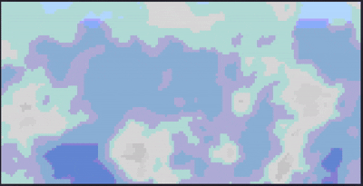
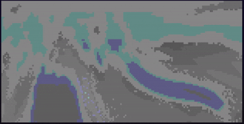

<div align="center">

# 🦀ruclouds ☁︎

Animated, drifting clouds in your terminal

<p>
  
  
  
  
</p>

</div>

- Built with Rust. Works on Windows (PowerShell, pwsh, cmd.exe) and Unix
(bash, Kitty, Alacritty, and other modern terminals). Adapts to terminal
resizing in real time.

- Inspired by lavat (lava lamp simulation in the terminal) - this project uses
noise-field cloud simulation instead of metaballs, taking a different approach
to achieve similar visual effects.

- (No copying intended, just drawing from the
same concept of terminal-based procedural animation.)

---

## Preview

<div align="center">
    
</div>

```bash
cargo run
```

You'll see continuously animated clouds drifting across a sky gradient.
Press `q` or `Esc` to quit cleanly. Your terminal is always left in a
clean state — even on panic or Ctrl+C.

---

## Installation

### From source

```bash
# Clone and run
git clone https://github.com/AndyFerns/ruclouds.git
cd ruclouds
cargo run --release

# Or install globally
cargo install --path .
ruclouds
```

### Pre-built binaries

Check the [Releases](https://github.com/AndyFerns/ruclouds/releases) page
for pre-built binaries for Linux, macOS (Intel + Apple Silicon), and Windows.

---

## CLI Flags

| Flag | Default | Description |
|---|---|---|
| `--speed <f32>` | `1.0` | Animation speed multiplier |
| `--density <f32>` | `0.5` | Cloud density threshold (0.0–1.0) |
| `--palette <name\|hex,hex>` | `white-grey` | Palette name or custom hex pair |
| `--wind-speed <f32>` | `0.3` | Wind speed |
| `--wind-angle <f32>` | `0.0` | Wind direction in degrees (0 = left→right) |
| `--fps <u32>` | `30` | Target frames per second |
| `--seed <u64>` | random | RNG seed for reproducible results |
| `--color-mode <mode>` | `auto` | `auto`, `truecolor`, `256`, or `ansi16` |
| `--no-sky` | off | Render against black instead of a sky gradient |

### Built-in palettes

- `white-grey` — Classic white clouds on a blue sky
- `sunset` — Warm orange/pink clouds on a sunset gradient
- `midnight` — Subdued grey-blue clouds on a deep dark sky
- `storm` — Heavy grey clouds on a dark overcast sky

Preview of toggling through all default palettes:

<div align="center">
    
</div>

### Custom palette

Pass two comma-separated hex colours (cloud-light, cloud-dark):

```bash
ruclouds --palette "FF88CC,442255"
```

---

## Keybindings

All keys are polled non-blockingly every frame — they never pause the animation.

| Key | Action |
|---|---|
| `+` / `-` | Increase / decrease animation speed |
| `[` / `]` | Decrease / increase cloud density |
| `c` | Cycle to the next colour palette |
| `w` | Cycle wind direction (0°, 45°, 90°, … 315°) |
| `g` | Toggle domain-warp intensity (subtle ↔ strong) |
| `r` | Reseed RNG and reset simulation time |
| `p` | Toggle "storm mode" (boosted speed + density) |
| `q` / `Esc` | Quit (clean shutdown) |
| `Ctrl+C` | Quit (same clean shutdown path as `q`) |

---

Preview of cycling through wind direction and changing domain-warp intensity values mid-animation:

<div align="center">
    
</div>

## How It Works

Each terminal cell represents **two vertical sub-pixels** using the `▀`
(upper half block) character — foreground colour is the top sub-pixel,
background colour is the bottom. This doubles the effective vertical
resolution for free.

The cloud simulation runs a 5-stage pipeline per sub-pixel every frame:

1. **Wind offset** — accumulated drift along the configured angle
2. **Domain warp** — a second Perlin noise bends the coordinate space for wispy shapes
3. **Fractal Brownian motion** — 4-octave fBm sampled in 3D `(x, y, time)` for smooth animation
4. **Density threshold** — Hermite smoothstep produces cloud opacity
5. **Shading** — offset fBm sample simulates puffy depth/shadow

The pipeline is a **pure function of `(x, y, time, wind_offset, config)`** —
it never depends on the grid's width or height. This is what makes terminal
resizing seamless: the simulation is always re-sampled fresh at whatever
resolution the buffer currently is, with no stretching, cropping, or motion
discontinuity.

Rendering uses a **double-buffer diff**: only cells that changed since the
last frame emit ANSI writes, minimising terminal I/O.

---

## Building

```bash
cargo build --release
```

Requires Rust 1.70+ (2021 edition).

---

## License

MIT
