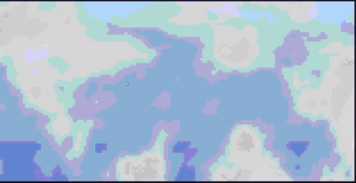

# Installation and Onboarding

## Prerequisites

- Rust 1.70 or later (2021 edition)
- A terminal that supports ANSI colors (most modern terminals)
- For best results, a terminal that supports truecolor (24-bit color)

## Installing from Source

### Clone and Run

```bash
git clone https://github.com/AndyFerns/ruclouds.git
cd ruclouds
cargo run --release
```

### Install Globally

```bash
cargo install --path .
ruclouds
```

This installs the binary to your Cargo bin directory, making it available system-wide.

## Pre-built Binaries

Pre-built binaries are available for Linux, macOS (Intel + Apple Silicon), and Windows on the [Releases](https://github.com/AndyFerns/ruclouds/releases) page.

Download the appropriate binary for your platform, make it executable (on Unix), and run it directly.

### crates .io download

> Coming soon!

## Quick Start

Once installed, simply run:

```bash
ruclouds
```

You'll see animated clouds drifting across a sky gradient. Press `q` or `Esc` to quit cleanly.

## Basic Usage

### Running with Default Settings

```bash
ruclouds
```

This starts with the default white-grey palette, 1.0 speed, 0.5 density, and auto-detected color mode.

### Customizing at Launch

You can customize various parameters using CLI flags:

```bash
# Faster animation
ruclouds --speed 2.0

# Denser clouds
ruclouds --density 0.8

# Sunset palette
ruclouds --palette sunset

# Custom wind direction (45 degrees)
ruclouds --wind-angle 45

# Higher frame rate
ruclouds --fps 60
```

### Combining Flags

```bash
ruclouds --speed 1.5 --density 0.7 --palette midnight --wind-speed 0.5
```

## Live Controls

Once running, you can adjust parameters in real-time using keyboard shortcuts:

- `+` / `-`: Increase/decrease animation speed
- `[` / `]`: Decrease/increase cloud density
- `c`: Cycle to the next color palette
- `w`: Cycle wind direction (0°, 45°, 90°, … 315°)
- `g`: Toggle domain-warp intensity (subtle ↔ strong)
- `r`: Reseed RNG and reset simulation time
- `p`: Toggle "storm mode" (boosted speed + density)
- `q` / `Esc`: Quit

Live Control preview of changing colour palette mid-animation

<div align="center">
    
</div>

## Color Mode Selection

The application auto-detects your terminal's color capability by default. You can override this:

```bash
# Force truecolor
ruclouds --color-mode truecolor

# Force 256-color mode
ruclouds --color-mode 256

# Force 16-color mode (basic ANSI)
ruclouds --color-mode ansi16
```

> im aware of some issues with colour palette selection on some terminals, ill try to fix them in the future.

## Custom Palettes

You can create custom color palettes using hex color pairs:

```bash
ruclouds --palette "FF88CC,442255"
```

The first color is the light cloud color, the second is the dark cloud color. The sky gradient uses default blues.

## Reproducible Results

Use the `--seed` flag to get reproducible cloud patterns:

```bash
ruclouds --seed 12345
```

This is useful for testing or if you want to recreate a specific cloud configuration.

## No Sky Mode

If you prefer clouds against your terminal's existing background instead of a sky gradient:

```bash
ruclouds --no-sky
```

( my personal favourite )

<div align="center">
    
</div>

## Troubleshooting

### Terminal Not Showing Colors

If colors aren't displaying correctly, try forcing a specific color mode:

```bash
ruclouds --color-mode 256
```

or

```bash
ruclouds --color-mode ansi16
```

### Performance Issues

If animation is slow, try reducing the frame rate:

```bash
ruclouds --fps 15
```

### Terminal Left in Broken State

This should never happen with ruclouds, but if it does, press `Ctrl+C` to force quit. The application includes a panic hook and RAII guard to ensure terminal state is always restored.

## Platform-Specific Notes

### Windows

Works on PowerShell, pwsh (PowerShell 7), and cmd.exe. Windows Terminal supports truecolor. Older cmd.exe may fall back to 256-color or 16-color mode.

### Unix

Works on bash and most modern terminals (Kitty, Alacritty, iTerm2, Hyper, WezTerm). Most of these support truecolor by default.

### macOS

Works in Terminal.app and third-party terminals like iTerm2. iTerm2 and other modern terminals support truecolor.
(not tested these extensively, so would love some extra support!)